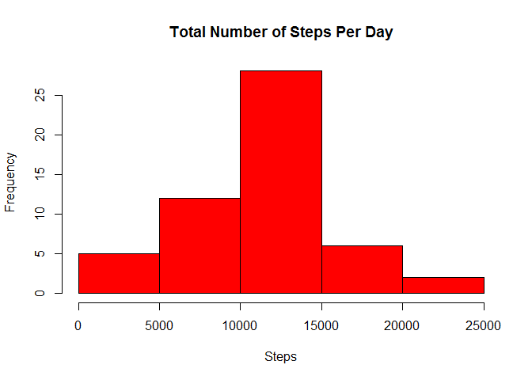
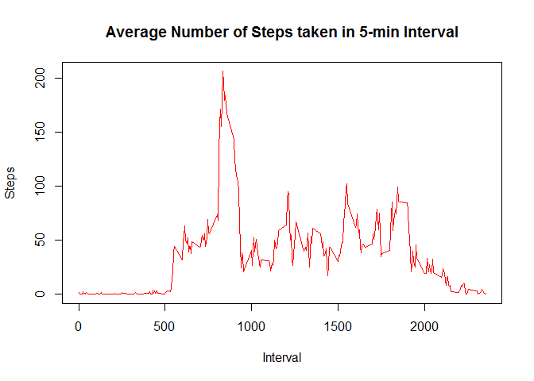
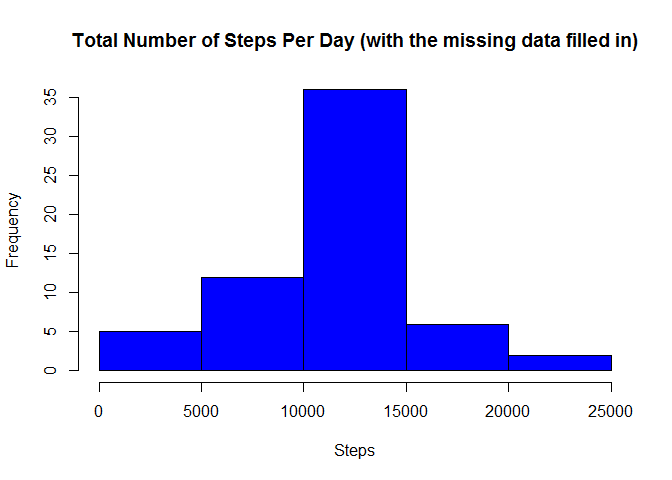
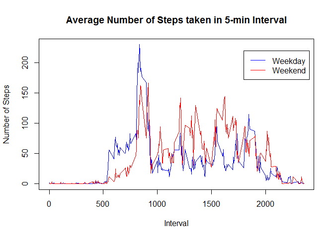

## Loading and preprocessing the data

1. Load the data:

```r
data <- read.csv("activity.csv", header = TRUE, sep=",")
```

2. Show the data:

```r
head(data)
```

```
##   steps       date interval
## 1    NA 2012-10-01        0
## 2    NA 2012-10-01        5
## 3    NA 2012-10-01       10
## 4    NA 2012-10-01       15
## 5    NA 2012-10-01       20
## 6    NA 2012-10-01       25
```

## What is mean total number of steps taken per day?

1. Calculate the total number of steps taken per day

```r
stepsByDay <- aggregate(steps ~ date, data, sum)
head(stepsByDay)
```

```
##         date steps
## 1 2012-10-02   126
## 2 2012-10-03 11352
## 3 2012-10-04 12116
## 4 2012-10-05 13294
## 5 2012-10-06 15420
## 6 2012-10-07 11015
```


2. Make a histogram of the total number of steps taken each day

```r
hist(stepsByDay$steps, col= "red", xlab = "Steps", main = "Total Number of Steps Per Day")
```

<!-- -->

3. Calculate and report the mean and median of the total number of steps taken per day

```r
data_mean_median <- c(mean(stepsByDay$steps), median(stepsByDay$steps))
names(data_mean_median) <- c("mean", "median")
data_mean_median
```

```
##     mean   median 
## 10766.19 10765.00
```

## What is the average daily activity pattern?

1. Extract data to calculate the average number of steps taken of the 5-minute interval

```r
averageSteps <- aggregate(steps ~ interval, data, mean)
head(averageSteps)
```

```
##   interval     steps
## 1        0 1.7169811
## 2        5 0.3396226
## 3       10 0.1320755
## 4       15 0.1509434
## 5       20 0.0754717
## 6       25 2.0943396
```

2. Make a time series plot (i.e. type = "l") of the 5-minute interval (x-axis) and the average number of steps taken, averaged across all days (y-axis)

```r
plot(averageSteps$interval, averageSteps$steps, type="l", xlab = "Interval", ylab = "Steps",
     main="Average Number of Steps taken in 5-min Interval", col = "red")
```

<!-- -->

3. Which 5-minute interval, on average across all the days in the dataset, contains the maximum number of steps?

```r
dataMax <- subset(averageSteps, steps == max(averageSteps$steps))
```

The interval contains max data is 835, and contain 206.1698113 steps:

## Imputing missing values
Note that there are a number of days/intervals where there are missing values (coded as \color{red}{\verb|NA|}NA). The presence of missing days may introduce bias into some calculations or summaries of the data.

1. Calculate and report the total number of missing values in the dataset (i.e. the total number of rows with \color{red}{\verb|NA|}NAs)

Number of missing values by column:

```r
colSums(is.na(data))
```

```
##    steps     date interval 
##     2304        0        0
```

2. Devise a strategy for filling in all of the missing values in the dataset. The strategy does not need to be sophisticated. For example, you could use the mean/median for that day, or the mean for that 5-minute interval, etc. Create a new dataset that is equal to the original dataset but with the missing data filled in.

The strategy selected for filling in all of the missing values in the dataset, was use the mean for that 5-minute interval.


```r
missingSteps <- data[is.na(data$steps), ]
newData <- data
newData[is.na(newData$steps), "steps"] <- averageSteps$steps[match(missingSteps$interval, 
                                                                   averageSteps$interval)]
head(newData)
```

```
##       steps       date interval
## 1 1.7169811 2012-10-01        0
## 2 0.3396226 2012-10-01        5
## 3 0.1320755 2012-10-01       10
## 4 0.1509434 2012-10-01       15
## 5 0.0754717 2012-10-01       20
## 6 2.0943396 2012-10-01       25
```

3. Make a histogram of the total number of steps taken each day with the new data


```r
sumdata <- aggregate(steps ~ date, newData, sum)
hist(sumdata$steps, col = "blue", xlab = "Steps", 
     main = "Total Number of Steps Per Day (with the missing data filled in)")
```

<!-- -->

4. Calculate and report the mean and median total number of steps taken per day for the nwe data


```r
newData_mean_median <- c(mean(sumdata$steps), median(sumdata$steps))
names(newData_mean_median) <- c("mean", "median")
newData_mean_median
```

```
##     mean   median 
## 10766.19 10766.19
```
5. Do these values differ from the estimates from the first part of the assignment? What is the impact of imputing missing data on the estimates of the total daily number of steps?

```r
diff_mean_median <- c(newData_mean_median[1] - data_mean_median[1],
                      newData_mean_median[2] - data_mean_median[2])
names(diff_mean_median) <- c("Diff mean", "Diff median")
diff_mean_median
```

```
##   Diff mean Diff median 
##    0.000000    1.188679
```
For it strategy the different is very low. By this reason, the impact of imputing missing data on the estimates of the total daily number of steps is low.

## Are there differences in activity patterns between weekdays and weekends?

1. Create a new datas indicating whether a given date is a weekday or weekend day.

```r
library(timeDate)
newData$Weekday <- isWeekday(newData$date)
weekday <- subset(newData, newData$Weekday == "TRUE")
weekdayMean <- aggregate(steps ~ interval, data = weekday, mean)
weekend <- subset(newData, newData$Weekday == "FALSE")
weekendMean <- aggregate(steps ~ interval, data = weekend, mean)
```

2. Make a panel plot containing a time series plot (i.e. \color{red}{\verb|type = "l"|}type = "l") of the 5-minute interval (x-axis) and the average number of steps taken, averaged across all weekday days or weekend days (y-axis). 

```r
plot(weekdayMean$interval, weekdayMean$steps, xlab = "Interval", ylab = "Number of Steps", 
     main ="Average Number of Steps taken in 5-min Interval", col ="blue", type="l") 
lines(weekendMean$interval, weekendMean$steps, col ="red", type="l")
legend(1800, 220, legend = c("Weekday", "Weekend"), col = c("blue", "red"), lty = c(1, 1))
```

<!-- -->
